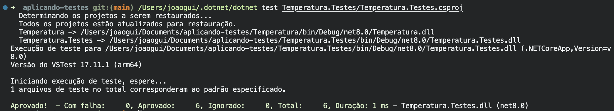
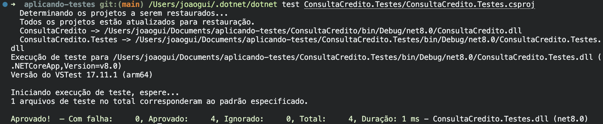
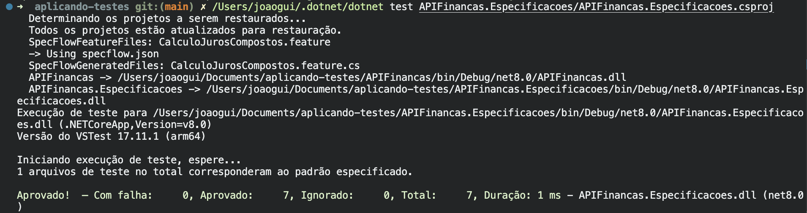

# Aplicando Testes

Repositório criado para aplicar os exemplos de testes apresentados no artigo [Testes de Software com .NET 5: exemplos de utilização](https://renatogroffe.medium.com/testes-de-software-com-net-5-exemplos-de-utiliza%C3%A7%C3%A3o-9b5514119ba2), de Renato Groffe.

> Observação: os exemplos seguem a organização e a lógica do tutorial, usando projetos .NET com xUnit, Moq, Fluent Assertions e SpecFlow. Nesta máquina foi usado o SDK .NET 8 para execução local dos testes.

## Testes de Unidade com xUnit

Testes de unidade validam uma parte pequena e isolada do sistema. Neste projeto, a classe `ConversorTemperatura` possui o método `FahrenheitParaCelsius`, responsável por converter temperaturas de Fahrenheit para Celsius e arredondar o resultado com duas casas decimais.

A aplicação do teste usa xUnit com `[Theory]` e `[InlineData]`, da mesma forma apresentada no tutorial. Assim, um único método de teste executa vários cenários de entrada e saída esperada, evitando repetição de código e facilitando a inclusão de novos casos.

Exemplos de cenários:

1. Quando a temperatura informada é `32°F`, o resultado esperado é `0°C`, validando o ponto de congelamento da água.
2. Quando a temperatura informada é `212°F`, o resultado esperado é `100°C`, validando o ponto de ebulição da água.

Print do teste sendo executado:



### Como executar

```bash
/Users/joaogui/.dotnet/dotnet test Temperatura.Testes/Temperatura.Testes.csproj
```

## Testes com Mock Objects usando Moq

Mock objects permitem testar uma regra de negócio sem depender diretamente de serviços externos, bancos de dados ou integrações reais. Neste projeto, a classe `AnaliseCredito` consulta a interface `IServicoConsultaCredito` para decidir se um CPF está sem pendências, inadimplente, inválido ou se houve erro de comunicação.

A aplicação do teste usa Moq para simular o comportamento do serviço de consulta de crédito. Cada CPF preparado no teste retorna um resultado diferente: lista vazia, lista com pendências, retorno nulo ou exceção. As validações são feitas com Fluent Assertions, deixando as expectativas mais legíveis.

Exemplos de cenários:

1. Quando o serviço retorna uma lista vazia para o CPF consultado, o resultado esperado é `SemPendencias`.
2. Quando o serviço retorna uma lista com uma pendência, o resultado esperado é `Inadimplente`.

Print do teste sendo executado:



### Como executar

```bash
/Users/joaogui/.dotnet/dotnet test ConsultaCredito.Testes/ConsultaCredito.Testes.csproj
```

## Testes BDD com SpecFlow

Testes BDD descrevem o comportamento esperado do sistema em uma linguagem mais próxima do negócio. Neste projeto, o arquivo `CalculoJurosCompostos.feature` apresenta cenários de cálculo de empréstimo com valor inicial, quantidade de meses, taxa mensal e valor final esperado.

A aplicação do teste usa SpecFlow para transformar os passos `Dado`, `Quando` e `Então` em chamadas de código. Os step definitions recebem os valores do cenário, executam o método `CalculoFinanceiro.CalcularValorComJurosCompostos` e validam o resultado com Fluent Assertions.

Exemplos de cenários:

1. Para um empréstimo de `R$ 10.000,00` em `12` meses com taxa de `2,00%` ao mês, o valor final esperado é `R$ 12.682,42`.
2. Para um empréstimo de `R$ 30.000,00` em `3` meses com taxa de `3,00%` ao mês, o valor final esperado é `R$ 32.781,81`.

Print do teste sendo executado:



### Como executar

```bash
/Users/joaogui/.dotnet/dotnet test APIFinancas.Especificacoes/APIFinancas.Especificacoes.csproj
```
